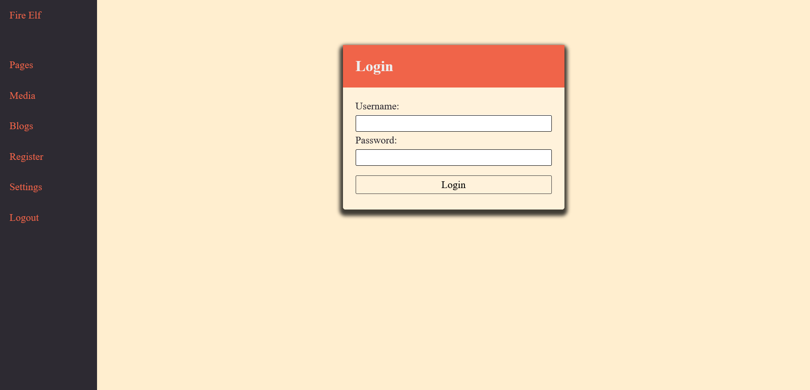
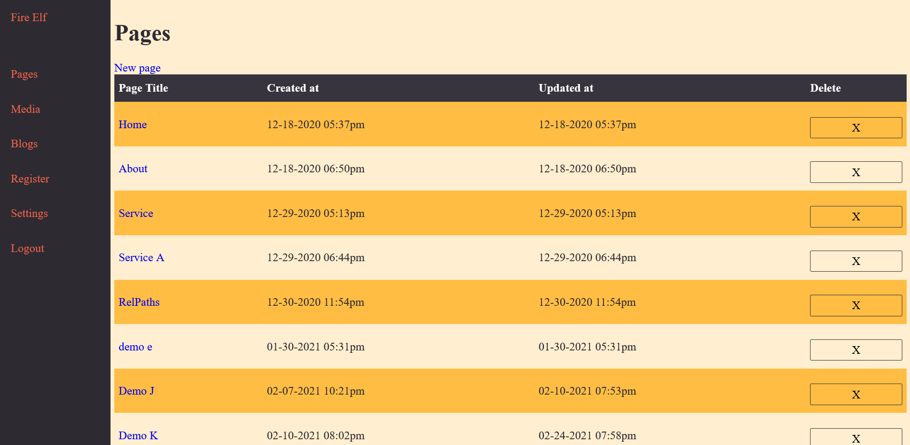
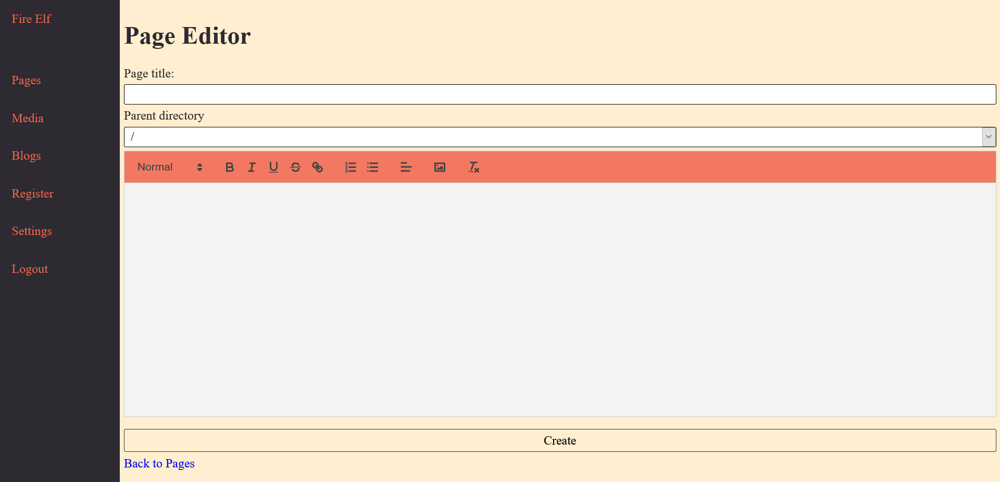
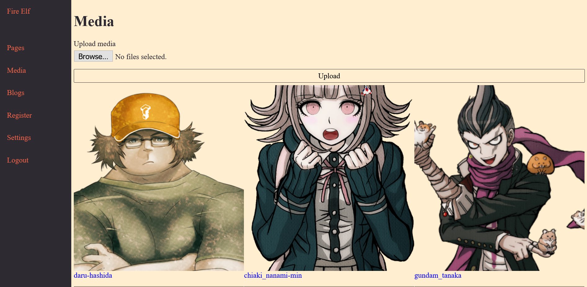
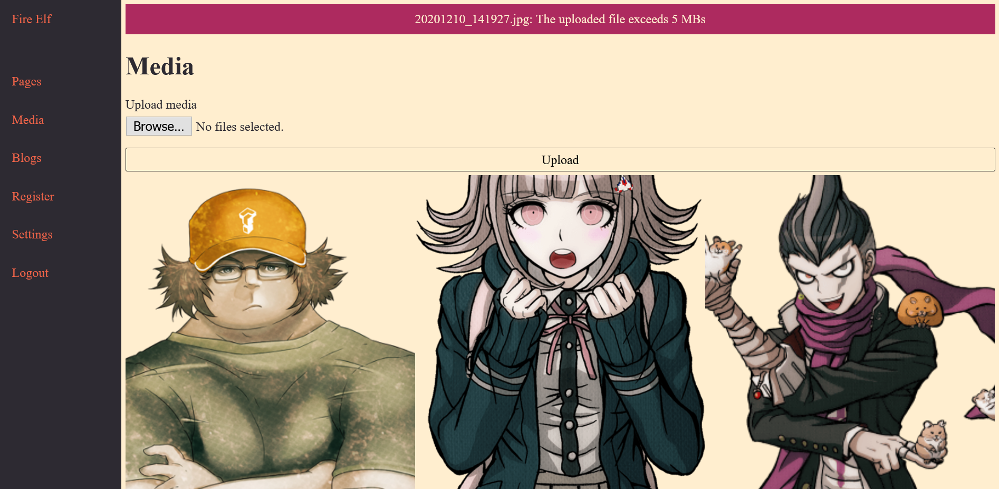
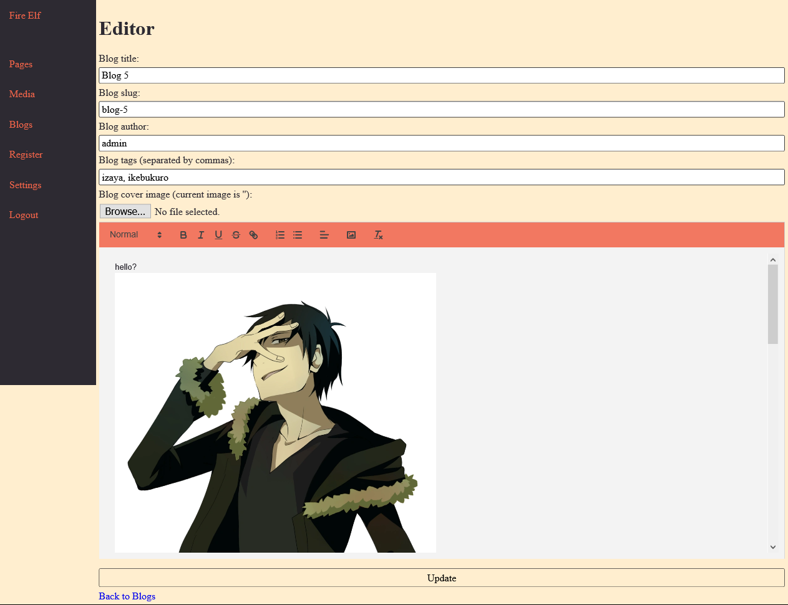
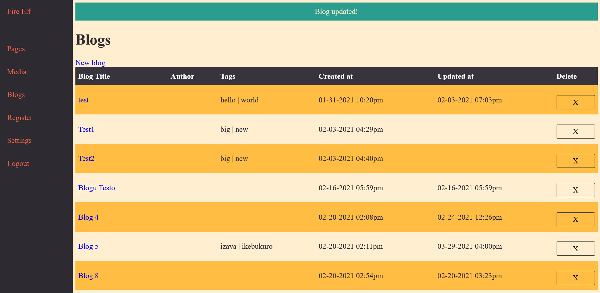

# Fire Elf

## About
Fire Elf is my attempt at making a basic WordPress CMS. This is inspired by [Tania's Laconia project](https://github.com/taniarascia/laconia) and my goal of learning the MVC architecture. Fire Elf does the very basics that WordPress does, such as CRUD operations for pages, images, and blogs. This project isn't ready for production use, but great for studying and forking.

## Run Locally
**these steps assume you run Windows**
1. clone this repo
2. in order to run locally, this project uses 2 different entry points; admin/ and client/. Setup a vhost within [XAMPP](https://www.apachefriends.org/index.html) (or any *AMP (e.g. LAMP, MAMP). The following steps may vary from XAMPP) to create multiple entry points
    1. open: `C:/xampp/apache/conf/extra/httpd-vhosts.conf`
    2. copy and paste the following to the bottom of the file to create the virtual web roots (double check that the file paths match the clone on your machine):
    ```
    <VirtualHost *:80>
        DocumentRoot "C:/xampp/htdocs/fire_elf/admin/public"
        ServerName admin.fireelf.xyz
    </VirtualHost>

    <VirtualHost *:80>
        DocumentRoot "C:/xampp/htdocs/fire_elf/client"
        ServerName fireelf.xyz
    </VirtualHost>
    ```
    3. open as **admin**: `C:/Windows/System32/drivers/etc/hosts`
    4. copy and paste to the bottom of the file:
    ```
    127.0.0.1 localhost
    127.0.0.1 admin.fireelf.xyz

    127.0.0.1 localhost
    127.0.0.1 fireelf.xyz
    ```
3. start up the PHP local web server
4. navigate to [the local admin website](http://admin.fireelf.xyz/) for the admin dashboard
5. admin login is
    - admin
    - root
6. navigate to [the local client website](http://fireelf.xyz/) for the client website
7. have fun!

## Tech Info
Some of the tech and tech concepts used:
- PHP
- MVC architecture
- basic htaccess usage
- PHP OOP and autoloading classes
- helper functions
- global config options

I did not use an external database, but instead created JSON files to save data. I found out that SQLite is probably a better option in this case, so I would like to incorporate this in the future.

## File Structure
```
/admin
    /public
        index.php
    /src
        /controllers
        /models
        /views

/client
    index.php
    .htaccess
    /pages
    ...
```
Fire Elf is broken down into ```admin``` and ```client``` directories. ```admin``` is the ```admin``` panel where, after logging in, the user can make changes to the public website, like WordPress. ```client``` is the actual public website.

```admin``` uses the MVC architecture and is divided up into ```controllers```, ```models```, and ```views```. There is a ```public``` and ```src``` directory. ```public``` contains the static assests, and ```src``` contains all of the logic. Requests to ```admin``` start at the index.php file in ```public```, then gets redirected to a controller in ```src```, which returns a view that is also located in ```src```.

```client``` can be arranged in any way, as long as index.php and .htaccess are at the root, and the pages are contained in a `pages` directory.

## Features
Fire Elf is able to perform CRUD operations on the different models present. So far, this includes ```Pages```, ```Media``` (images), and ```Blogs```. The settings page can alter the ```User``` model. Pages can be created, edited, and deleted using the [Quilljs wysiwig editor](https://quilljs.com/). The same goes for Blogs. Images can be uploaded and deleted, and gets stored in a media library similar to WordPress. Within the Quilljs editor, the user can open the media library.

## Future
Features to add in the future:
- add user roles
- add nav management to change client navigation
- add more media types (pdf, gifs, docx)
- replace JSON with SQLite
- manipulate branding colors
- add class namespaces

## Images
Some images of the project

Login page

Pages page

Page editor page

Media page

Media with error

Blog editor page

Blog with success